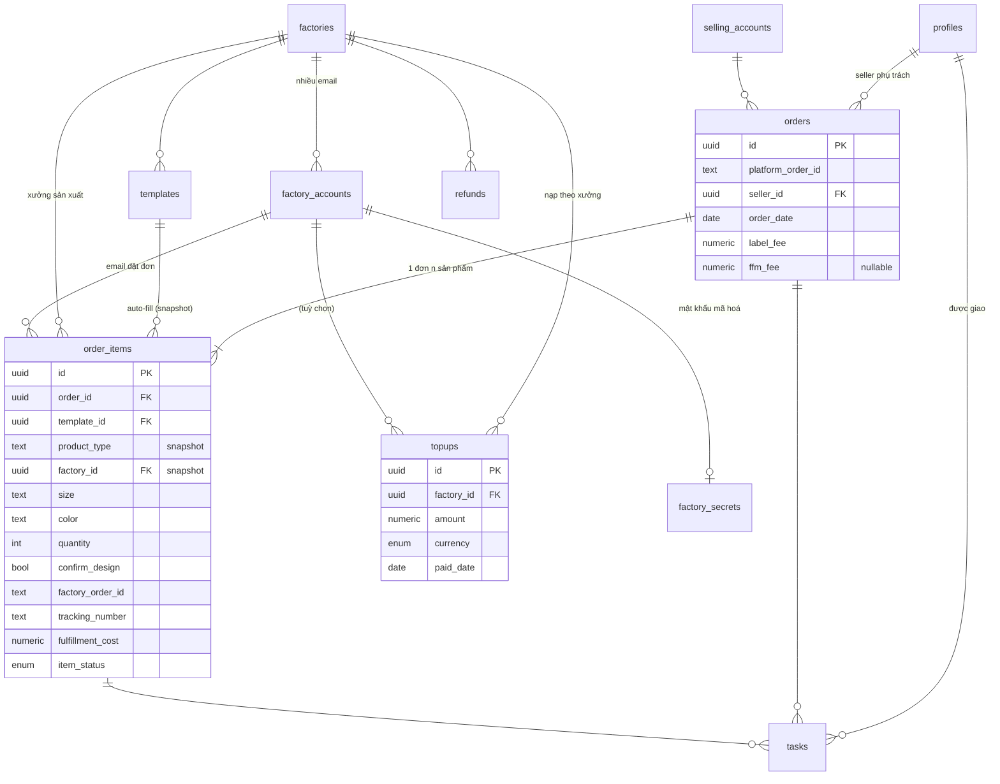

# FFM Tool — Thiết kế dữ liệu (bản duyệt)

> Phạm vi: **vận hành FFM**. Không đưa doanh thu / lãi-lỗ sản phẩm.
> Giữ tài chính FFM: chi phí xưởng + topup + số dư. Có sẵn `orders.ffm_fee` (nullable) để bật P&L của FFM sau.
> DDL đầy đủ: [schema.sql](schema.sql).

## 1. Sơ đồ quan hệ (ERD)

## 2. Bảng & vai trò

| Bảng | Thay sheet Excel | Ghi chú |
|------|------------------|---------|
| `profiles` | (mới) | Người dùng + role: seller / ffm / admin + telegram để nhắc việc |
| `factories` | FFM Supplier, So sánh nhà in, Tìm xưởng POD | Gộp 3 nguồn; `status` phân biệt đang dùng / đang đánh giá |
| `factory_accounts` + `factory_secrets` | Tài khoản, Tài khoản FFM | 1 xưởng nhiều email; mật khẩu **mã hoá**, RLS chặt |
| `selling_accounts` | (cột "Tài khoản bán hàng") | Dropdown TTS33/AMZ… — **chặn gõ sai** (TTTS28, TT29) |
| `templates` | Template Design | Nguồn auto-fill; khoá tự nhiên = `code` |
| `orders` | Tổng hợp đơn + sheet từng Seller (phần đơn) | 1 đơn sàn = 1 dòng |
| `order_items` | Tổng hợp đơn + sheet từng Seller (phần sản phẩm) | **Pipeline fulfillment ở đây** |
| `topups` | YCTT Topup / FFM | Nạp **theo xưởng** |
| `refunds` | YCTT Topup / Hoàn tiền | |
| `payments` | YCTT Topup / Pink DS | Thanh toán khác (VND) |
| `tasks` | Design (log sửa) + giao việc | `type=design_fix` thay sheet Design |
| view `v_factory_balance` | Thống kê topup | Số dư = nạp − tiêu + hoàn |
| view `v_order_status` | (mới) | Trạng thái đơn rollup từ item |

## 3. Sở hữu cột (ai được nhập) — theo "Hướng dẫn cột" của bạn

| Nhóm | Cột | Chủ | Cơ chế |
|------|-----|-----|--------|
| Đơn | platform, order_id, selling_account, seller, order_date, shipped_by, label, label_fee, customer_*, seller_note | 🔵 Seller | RLS: seller sửa đơn của mình |
| Sản phẩm (nhập) | template, size, color, quantity, sku_phoi, design_link, confirm_design | 🔵 Seller | |
| Sản phẩm (auto) | product_type, factory_id, dimension | ⚙️ Auto | Copy snapshot từ template khi chọn |
| Fulfillment | factory_account, factory_order_id, tracking_number, tracking_status, fulfillment_cost, item_status | 🟢 FFM | RLS + **trigger** chặn seller sửa |
| Tài chính | topups, refunds, payments | 🟢 FFM/Admin | RLS |

Seller **đọc được** cột FFM (để biết tracking mà sync sàn) nhưng **không ghi** được.

## 3b. Phân quyền 2 chiều: Role (LÀM gì) × View scope (THẤY gì)

Tách rời để "sắp xếp nhân sự dễ hơn" — set độc lập cho từng người trong `profiles`:

**Chiều 1 — Role (quyền thao tác):**

| Role | Được làm |
|------|----------|
| `seller` | Tạo/sửa đơn của mình (cột 🔵 Seller), giao design |
| `ffm` | Cập nhật fulfillment (🟢), tài chính, template, xưởng |
| `admin` | Toàn quyền + quản trị user/phân quyền |

**Chiều 2 — View scope (phạm vi xem):** `own` = chỉ đơn mình phụ trách · `all` = xem toàn bộ đơn.

**Kết hợp (ma trận thực tế):**

| Ví dụ nhân sự | role | view_scope | Kết quả |
|---------------|------|-----------|---------|
| Seller thường | seller | own | Chỉ thấy + sửa đơn của mình |
| Trưởng nhóm seller | seller | **all** | **Thấy toàn bộ** đơn, nhưng **chỉ sửa** đơn của mình |
| Ngọc (FFM) | ffm | all | Thấy hết, cập nhật fulfillment mọi đơn |
| Quản lý/Chủ | admin | all | Toàn quyền |

> **Nguyên tắc cốt lõi:** *xem-toàn-bộ ≠ sửa-toàn-bộ.* `view_scope='all'` chỉ mở **quyền ĐỌC** (SELECT); quyền GHI vẫn theo sở hữu đơn + role. Cài bằng hàm `my_scope()` / `in_scope()` trong [schema.sql](schema.sql) (3 scope độc lập view/edit/delete — xem thêm mục 3b bên trên), Admin bật/tắt cho từng người.

## 4. Pipeline trạng thái (item_status)

`new → waiting_design → design_ok → ordered → in_production → has_tracking → synced → delivered`
Nhánh: `issue` (hoàn/reprint/dispute), `cancelled`.
Trạng thái đơn = rollup: có item `issue` → đơn `issue`; tất cả `delivered` → đơn `delivered`; còn lại lấy bước thấp nhất.

## 5. Giả định cần bạn xác nhận (trước khi code UI)

1. **1 order_id sàn = 1 đơn** (nhiều sản phẩm tách thành items). Bỏ cách lặp dòng + hậu tố `-Point`/`-Pointed`. → OK không?
2. **FFM có thu phí seller không?** Nếu có → dùng `orders.ffm_fee` (đã thấy ghi chú "công nợ nội bộ" ở A2K). Nếu không → để trống, bỏ mọi thứ liên quan lãi-lỗ.
3. **Số dư topup ở cấp xưởng** (không phải theo từng email). Đúng với cách bạn đang ghi chứ?
4. **"Seller Name"** (Hằng, Yến, Tú…) là **nhân sự nội bộ** → mỗi người 1 tài khoản đăng nhập. Đúng không? (Nếu là khách ngoài thì mô hình khác.)
5. Tài chính chỉ theo dõi **USD (xưởng) + VND (Pink Design)** — chưa cần quy đổi tỷ giá. OK cho MVP?

## 6. Điểm tôi đã tự sửa khi phản biện (ghi lại để tra cứu)

- Topup theo **xưởng**, không theo email account.
- Seller **đọc full** đơn của mình, chỉ chặn **ghi** cột FFM (không giấu tracking).
- Cột auto = **snapshot** (không phải FK sống) để không đổi ngược lịch sử.
- Pipeline + tracking + cost đặt ở **order_items** (không ở order).
- Thêm `cost_currency` (xưởng VN/CN), `factories.status` (gộp prospect).
